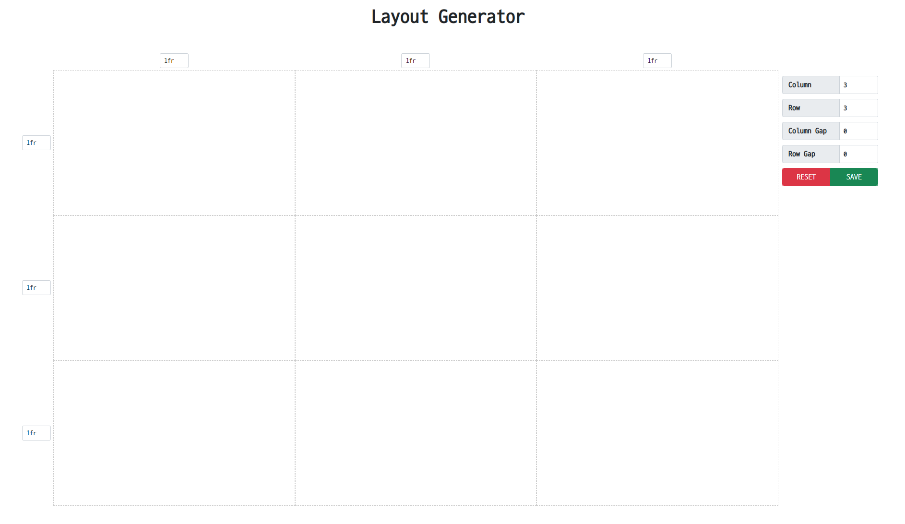
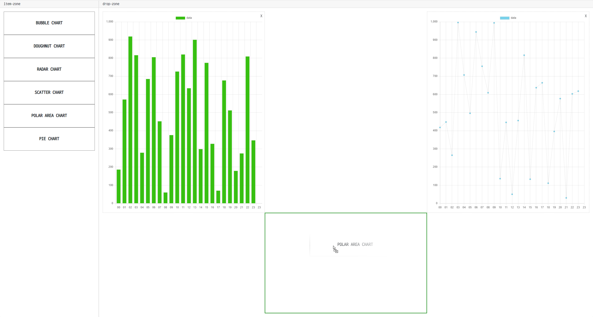

# DnD-With-Layout-Generator

## 🌳Tree

```
DnD-With-Layout-Generator
│ dnd.html ❓ drag and drop page
│ generator.html ❓ layout generator page
│ index.html ❓ layout generator + dnd page
│ LICENSE
│ README.md
└─assets
    ├─css
    │ connector.css ❓ layout generator + dnd
    │ dnd.css
    │ generator.css
    │ reset.css ❓ default style reset
    │
    └─js
      connector.js ❓ layout generator + dnd
      dnd.js
      generator.js
```

## 💬 What is this ?

Layout generator & component Drag n Drop UI based on Grid

## 📖 Pages

### Layout Generator

-   motive : https://github.com/sdras/cssgridgenerator



### Component Drag n Drop



## 🔧 Function

-   Grid Cell Resize
-   Grid Cell Merge
-   Create Grid Layout
-   Drag and Drop Chart Component
