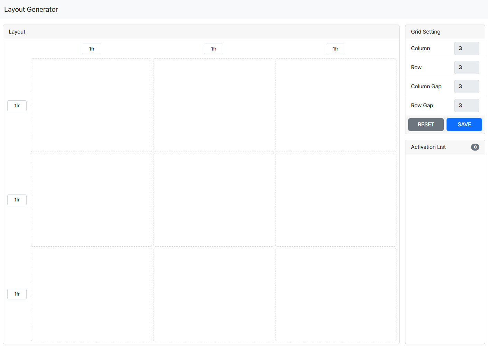
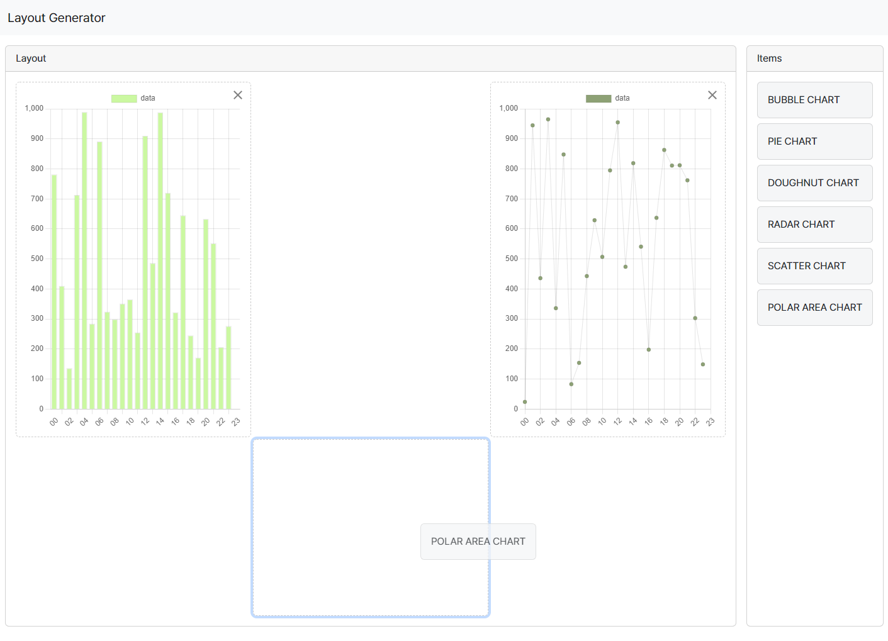

# DnD-With-Layout-Generator

```
static - html files
dist - compiled files
src - source files
```

Forked from : https://github.com/mspark2Dev/DnD-With-Layout-Generator

## 💬 What is this ?

Layout generator & component Drag n Drop UI based on Grid

## 📖 Pages

### Layout Generator

-   motive : https://github.com/sdras/cssgridgenerator



### Component Drag n Drop



## 🔧 Function

-   Grid Cell Resize
-   Grid Cell Merge
-   Create Grid Layout
-   Drag and Drop Chart Component


